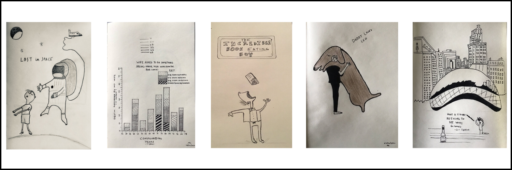

As far as I can remember, I enjoyed everything about art and the people who make it (artists). In elementary school, I enjoyed crayons and a sketchbook. I was never good, but the constant chase of making something with pen on paper got me lost from real-world problems. An underlying reason which I found very therapeutic at an early age.

Things got in way and I abandoned my crayons and sketchpad.

In college during my final quarter, I took some creative classes. I didn't need the GPA boost, but I was missing some credits before I could graduate. This forced me to explore classes I would enjoy without having to worry about grades or requiring extra motivation. One was Music Theory 101 and the other was Art 101. I don't remember anything about music theory, but I do remember things I drew, painted and sketched in my art class. To this day (after 8 years), I periodically go over my sketchpad that I used during the class.

Suddenly Covid hit in 2020 and I picked up on making art again after work and during the weekends. Suddenly, I realized again, how therapeutic drawing was. I forgot about everything that was going around me. To come to realizaton on a hobby that makes you forget your surroundings and problems was very powerful to me. Making art is like meditating with a pen which requires no typing or browsing endlessly on devices.

Art is contextual. It depends on so many conditions such as emotions, interests, perspectives, local issues, global issues and more. Art uncovers stigma, truth and propaganda. It is inspiring and moving. There is something else about making art which is getting lost in process. It is a constant iteration and never stops. Work of an artist is never completed only abandoned.

I have emulated my sketches from contemporary artists— Oliver Jeffers and Jean Julian. Their work takes me back to childhood bringing both fine art and illustration together.

> If art is to nourish the roots of our culture, society must set the artist free to follow his vision wherever it takes him. We must never forget that art is not a form of propaganda; it is a form of truth. — JFK

> If you hear a voice within you say 'you cannot paint,' then by all means paint, and that voice will be silenced. — Vincent Van Gogh