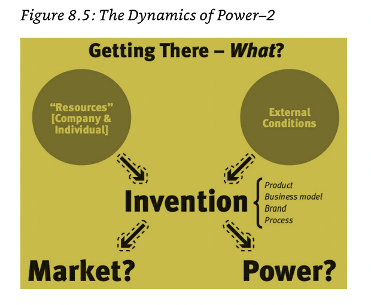
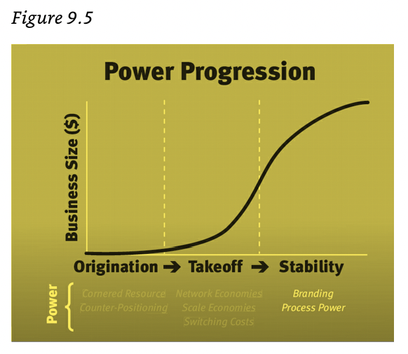
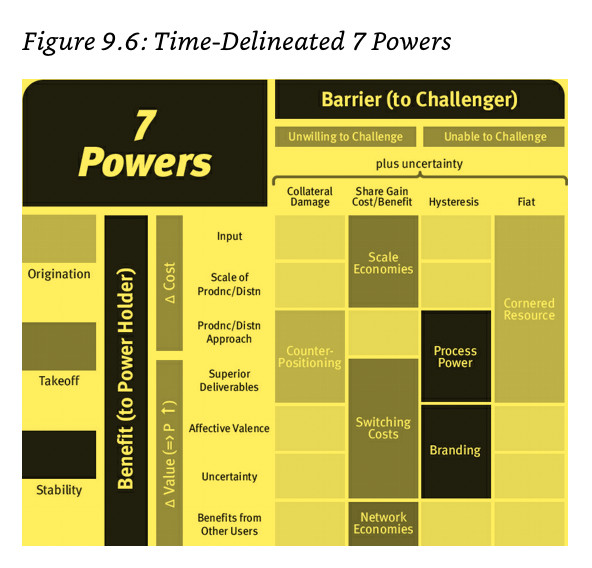

## I. Brief Summary
I thoroughly enjoyed this book and realized how misunderstood the discipline of strategy is. Helmer covers 7 powers that companies can leverage on. He demystifies that operational excellence is not a strategy. He also shows invention is a source for all these powers. Helmer lays out an insightful framework to think about competitive advantage. This is a text I will come back more often to. The text details specific conditions that results in Power (Part I: Statics) and how to attain them (Part II: Dynamics).

## II. Big Ideas

### Strategy vs strategy
- Strategy: the study of the fundamental determinants of potential business value.
- Strategy can be usefully separated into two topics: 
    - Statics—i.e. “Being There”: what makes Intel’s microprocessor business so durably valuable? 
    - Dynamics—i.e. “Getting There”: what developments yielded this attractive state of affairs in the first place?
- Power: the set of conditions creating the potential for persistent differential returns.
- strategy (lower s): a route to continuing Power in significant markets.
- “Strategy” is tied to value and “strategy” is tied to Power.

### 7 Powers
1. Scale Economies: A business in which per unit cost declines as production volume increases.
2. Network Economies: A business in which the value realized by a customer increases as the installed base increases.
3. Counter-Positioning: A newcomer adopts a new, superior business model which the incumbent does not mimic due to anticipated damage to their existing business.
4. Switching Costs: The value loss expected by a customer that would be incurred from switching to an alternate supplier for additional purchases.
5. Branding: The durable attribution of higher value to an objectively identical offering that arises from historical information about the seller.
6. Cornered Resource: Preferential access at attractive terms to a coveted asset that can independently enhance value.
7. Process Power: Embedded company organization and activity sets which enable lower costs and/or superior product, and which can be matched only by an extended commitment.

### What & How to Establish Powers?

- “What must I do to establish Power?” and “When can I establish it?” Part II of this book reveals the answers to these questions. 
    - Here’s the first important takeaway from our consideration of Dynamics: “getting there” (Dynamics) is completely different from “being there” (Statics).
    - To assess which journeys are worth taking, you must first understand which destinations are desirable. Fortunately the 7 Powers does exactly that: it maps the only seven worthwhile destinations.
    - All Power starts with invention, be it the invention of a product, process, business model or brand. The adage “‘Me too’ won’t do” guides the creation of Power. Invention propels the other key element of the Fundamental Equation of Strategy—market size.
    - Planning rarely creates Power. It may meaningfully boost Power once you have established it, but if Power does not yet exist, you can’t rely on planning. Instead you must create something new that produces substantial economic gain in the value chain.
    - 
    - Operational excellence by itself is not enough.

### The Clock for the Power Progression
- Stage 1: Before—Origination. This occurs before a company clears the compelling value threshold, at which time sales rapidly pick up pace. There are two types of Power that typically become first available during this earlier period.
    - Cornered Resource
    - Counter-Positioning
- Stage 2: During—Takeoff. This is the period of explosive growth. There are two types of Power that typically become available during this period.
    - Network Economies
    - Scale Economies
    - Switching Costs
- Stage 3: After—Stability. The business may still be growing considerably, but growth has slowed from “explosive” levels, with 30–40% per-year unit growth as a workable choice for the cutoff. Above this rate, the market doubles in two years, sufficiently fluid for market leadership swaps without value-destroying counter-moves. A word of caution: parsing by growth should not create the impression that the phases above are congruent with the well-known product life cycle stages of introduction, growth, maturity and decline. Finally, there are two types of Power that are likely to be established in the stability stage.
    - Process Power
    - Branding
- 

## Barriers
- This pulls into focus another Dynamics insight: each of the four generic Barriers is specific to stage. This results from the nature of those barriers:
    - Hysteresis. The Barrier here? A structural time constant facing all players. It makes sense, then, that all Powers relying on hysteresis would only become available in the stability stage, as the takeoff stage is relatively short-lived and does not usually provide sufficient time to build up the Benefit, constrained as it is by the time constant.
    - Collateral Damage. Here it is the economics of the challenger’s business model which threatens collateral damage to the incumbent. But, the initiation of this business model is what gets the challenger off the ground so it must occur in origination.
    - Fiat. The critical issue here concerns whether the “right” protected by fiat is fully priced. As the business proposition involving the Cornered Resource develops during takeoff, the resource’s value becomes more widely known, substantially reducing the probability that it will be materially underpriced, and it must be underpriced to qualify as a Cornered Resource.
    - Cost of Gaining Share. Of course the whole notion of gaining share carries no meaning in the origination stage, as sales have not yet materialized. When the business takes off, there are many factors which determine which company can scale most rapidly: channel position, product features, communication approaches, location, production constraints, etc. As a consequence, the “price” of share usually does not reflect its intrinsic long-term value. Upon reaching the stability stage, the most effective modalities become better known and accessible to many players. There the customer’s focus turns from “Can I get it?” to “What is the best deal?” In this situation, each player grasps the value of share and will game accordingly, usually arbitraging out its value. Hence, generally speaking, only in the takeoff stage can a player gain share on attractive terms; otherwise it is too costly to be worthwhile.

### 7 Powers Framework
- 

## III. Quotes
- The arc of any celebrated business is underpinned by decisive strategy choices that are few and typically made amidst the profound uncertainty of rapid change. Get these crux choices wrong and you face a future of persistent pain, or even outright failure. To get them right, you must constantly attune your strategy to unfolding circumstances—ponderous planning cycles or handoffs to outside experts won’t get you there.s
- “Chance only favors the prepared mind.” Strategy serves best not as an analytical redoubt, but rather in developing the “prepared mind” of those on the ground.
- A Strategy framework must be “simple but not simplistic.” Easier said than done, though. For a subject as complex as Strategy, “simple but not simplistic” is a high hurdle.
- My many years of advising companies and making value-driven equity bets has made it crystal clear to me that the ascent of great companies is not linear but more a step function.
- Internally, corporate antibodies were in full force.
- Semiconductors are a component, not an end product.
- “The one-sentence story of Intel is a single design win, then a decade and a half of very high Switching Costs, then Scale Economies.”  — Bill Mitchell
- With these ideas as your toolkit, you are now fully prepared to blaze your own path to satisfying The Mantra: A route to continuing Power in significant markets.