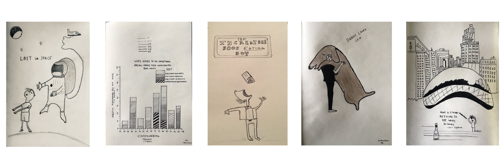

As far as I can remember, I enjoyed everything about art and the people who make it—artists. In elementary school, I enjoyed crayons and a sketchbook. I was never good, but the constant chase of making something with pen and paper made me forget real-world problems. An underlying reason which I found art very therapeutic at an early age.

Things got in the way so I abandoned my crayons and sketchpad.

In college during my final quarter, I took some creative classes. I didn't need the GPA boost, but I was missing some credits before I could graduate. This forced me to explore and enjoy classes without having to worry about grades or finding extra motivation to study for exams. One was _Music Theory 101_ and the other one was _Art 101_. I don't remember much about music theory, but I do remember things I drew, painted and sketched in my art class. To this day (after 8 years), I periodically go over my sketchpad that I used during the class.

Suddenly Covid hit in 2020 and I picked up on making art again after work and during the weekends. Suddenly, I realized how therapeutic drawing was. I forgot about everything that was going around me. I came to a realizaton that getting lost in the process of making and creating art was therapeutic. Everyone should find hobbies because they inspire us to tap into our creative side. Making art is like meditating with a pen which requires no typing or browsing endlessly on devices. It requires singular focus. Below are some of the sketches from 2020 quarantining.

Art is contextual. It depends on so many conditions such as emotions, interests, perspectives, local issues, global issues and more. Art uncovers stigma, truth and propaganda. It is inspiring and moving. There is something else about making art which is getting lost in the process and letting our imaginations play out. It is an iterative process which never stops. To say the least, work of an artist is never completed, only abandoned.

I have emulated my sketches from contemporary artists such as Oliver Jeffers and Jean Julian. Though, I am obsessed with Oliver Jeffers. His work takes me back to childhood which I can't really explain why. His work is poetic in some sense which addresses ongoing issues of the world. His illustrations and stories are fundamental that can be undestood both by a kid and an adult. Curiosity and humor are underlying themes of his work which I am drawn to in real life.

> If art is to nourish the roots of our culture, society must set the artist free to follow his vision wherever it takes him. We must never forget that art is not a form of propaganda; it is a form of truth. — JFK

> If you hear a voice within you say 'you cannot paint,' then by all means paint, and that voice will be silenced. — Vincent Van Gogh