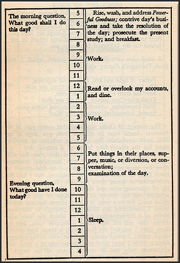
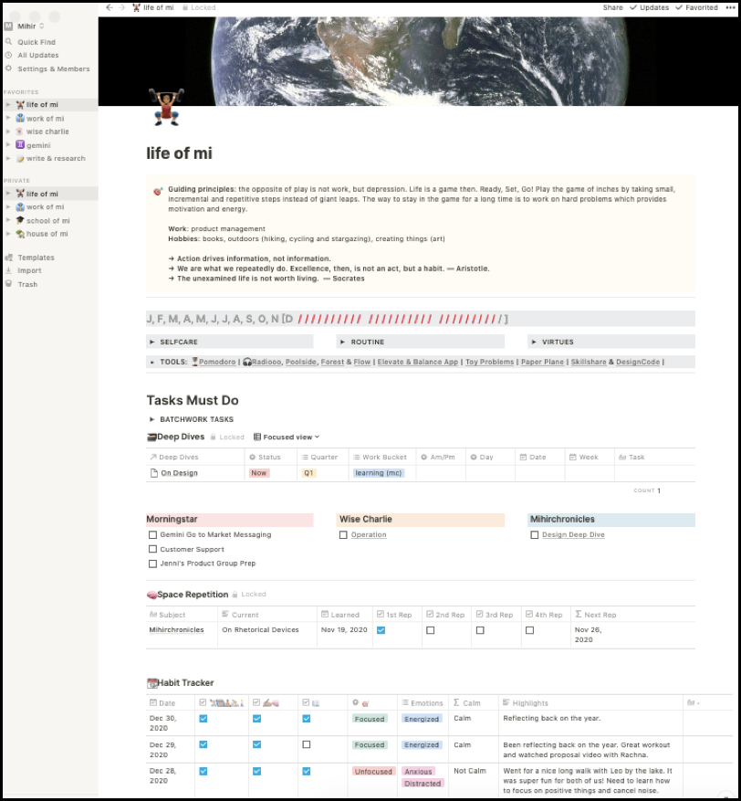

_Systems Thinking_ also known as _process driven mentality_ over _goal driven mentality_ has become common these days.

Why?

A well-defined process can unload cognitive overhead by nurturing creativity. Creativity never stops. A well defined process also never stops. But goals do! Systems can be superpower or supervillain.

## Process vs goals
I often thought chasing goals would yield happiness. But just like a butterfly, the more I chased goals, the more it evaded me. The moment I abandoned that chase, I found butterflies sitting on my shoulders. Process allows us to be mindful and observe things around us. Process allows to go on a journey.

> The mindset isn't about seeking a result — it's more about the process of getting to that result. It's about the journey and the approach. It's a way of life. I do think that it's important, in all endeavors, to have that mentality. — Kobe Bryant

Direction then becomes so much important than speed because goals are time bounded whereas process is not. Process allows us to account for failures and being wrong. It supports the complexity of life and it works beautifully if it has a feedback loop. We can turn up the lever up or down depending on how the day is going.

Life-changing transformations don't happen overnight. It requires mundane, everyday lifestyle choices over long-period of time. Setting a time bounded goal of eating healthy is a short-term thinking vs a healthy lifestyle. Another example looking for a quick dollar vs investing for a long-term.

A well-defined process allows for a long-term over short-term outcomes. It accounts for small and incremental changes which then forces us to build right habits, sustainable work-ethic, and positive behavior. This takes a lot of time and effort, but when compounded over time, it seems to be the best path towards true and meaningful progress.

The danger with goals is that when reached, the motivation seems to decline. Goal seeking mode will lead to a depression wall. Goals are generally gamified and yield to short-term benefits. Goals are outcome based.

Hence, systems are better than goals. Systems are superpower!

## Process itself is the goal

_Process itself is the goal_. This is my only goal in life when it comes to setting goals. I say this loudly and repetitively to remind myself that goals are trap (to a certain extent). But it didn't start out that way. In an information driven culture, I saw ambitious goals of others, so I also wanted to set ambitious goals for myself. Read 24 books in a year. Start a company by xyz date. Travel x amount of times. Accumulate x amount of wealth.

First, I didn't always accomplish these goals. Reading was the closest thing I could accomplish, but that also became a task. So I abandoned a hobby that I enjoyed so much. Second, I felt empty if I ever accomplished any of my goals.

Then I came across _Deep Work_ by _Cal Newport_ and _focused and diffused_ technique by _Dr. Barbara Oakley_. I adopted those lessons in my own workflow. However, I still kept up with setting goals for every new year. My productivity increased and I managed to accomplish several of my goals. But the feeling of emptiness persisted. 

Goal setting was clearly becoming a status game so lessening the importance of accomplishing x number of goals became a primary objective. I started focusing more on process. A system that would enable the dynamics of any given day.

## Benjamin Franklin
I started taking an inspiration from Benjamin Franklin's daily system. He was a systems thinker and he also accomplished a lot in his lifetime. In his schedule, he laid out daily questions at the start of the day and at the end of the day: _what good shall I do today?_ and _what good I have done today?_ This is a very simple and impactful system. This was his way of reflecting everyday while moving forward. We call that journaling which I wasn't doing it at this time.

 

## Tool: Notion
I started building a system for myself but by leveraging on digital tools. Note taking on Apple Notes. Maintaining lists and projects on Trello. To-do lists on Apple Reminder app. It was frustrating to manage so many apps but I started building habits. I tracked down daily journaling, exercising, meditation, conducting deep work, reading and writing. Everything else went into a dumpster list (a list that has no meaning). The importance of daily habits and activities started to emerge. I used feedback loop to keep refining my process. I am entering my 4th year of no goals and I have accomplished more than I could've ever imagined. And the most important of all, I no longer feel empty. Below is my process that works for me which I'd like to document. These tools work for me today, but will change tomorrow. Tools do not define my process, but the process does. However, tools play an important role to keep up with the process.

Notion has been a game changer for me. I no longer have to manage several apps. One does it all. Below is my personal dashboard that I have been iterating over for the last 2 years. This has cultivated many great habits. I no longer have to think about workouts, reading or journaling. Everything is a default. 

I also have a simple formula that measures my calmness. If the tags selected are anxious, angry or distracted it shows me _Not Calm_. If the tags consists of positive feelings, then it shows me _Calm_. I measure my mental well being on a state of calmness, not on sadness or happiness. 

Lastly, I also measure a sense of urgency every month to see how well I am progressing towards my monthly committed tasks. On top of the page, I highlight slash every day which indicates how many days I have gone by in a given month. The slashes in grey shows remaining days to finish up committed tasks. This allows me to stay distraction-free.

I have 4 main folders in the project: life of mi, work of mi, school of mi and house of mi. The naming was inspired by the novel _Life of Pi_. If I am collecting a list of books, exploring topics or researching a topic, it will go in school of mi folder.

That's my “simple process” which allows me to do systems thinking. However, systems thinking can be supervillain.

 

## Caution against systems thinking
A system is useless without a good goal to guide it. System driven thinking has gotten popular because it can lead to mediocrity. You cna fool yourself by checking off boxes that you are working out. But if no results have been gained over a period of time, system is broken. You need a system with well-defined feedback loops. Process can invite a participation trophy which is not meaningful at all. This is especially attractive to procrastinators. But if a system is well defined and used deliberately, it can bring a positive change. Goals are good for setting a direction, but systems are best for making progress. They both yield results. A meaningful one or not is upon you to decide.